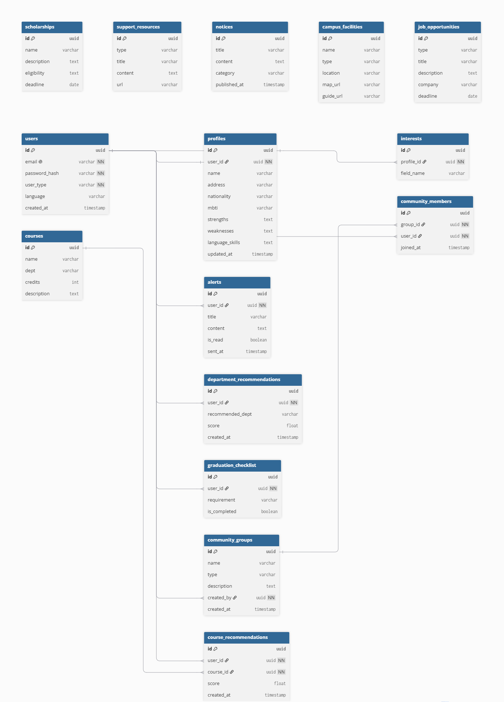
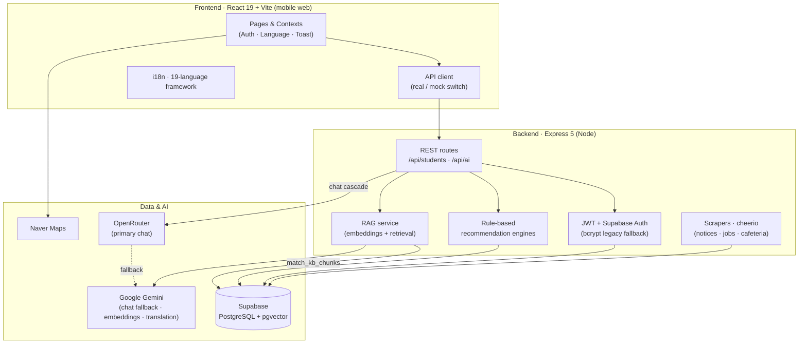
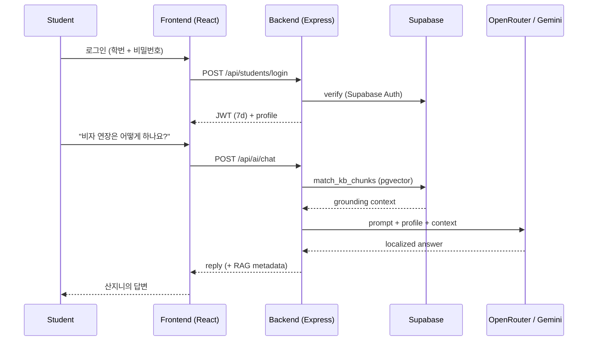

# 안녕! 부산대 (Hey! PNU)

> **부산대학교 외국인 유학생을 위한 원스톱 통합 플랫폼**
> An all-in-one onboarding & academic hub for international students at Pusan National University.
>
> 제7회 PNU 창의융합AI해커톤 · 융합트랙 · 팀 **5 Guys**

<p align="center">
  
</p>

---

## 1. 프로젝트 소개 · Project Overview

### 1.1. 개발 배경 및 필요성 · Background & Motivation

**KO** — 대한민국은 'Study Korea 300K Project'를 통해 2027년까지 외국인 유학생 30만 명 유치를 목표로 하고 있으며, 국내 대학의 외국인 유학생 수는 꾸준히 증가하고 있다. 그러나 실제 유학생들이 겪는 정보 접근과 정착의 어려움은 여전히 해소되지 못하고 있다. 유학생들은 대학 지원 단계부터 입국 이후 정착까지 **파편화된 정보 환경** 속에서 국제처 홈페이지, 기숙사 포털, 각 학과 페이지, Hi Korea 등 여러 곳을 개별적으로 찾아다녀야 한다. 상이한 입학 요강, 복잡한 행정 절차, 언어 장벽, 생활 정보 부족이 겹치며 초기 적응에 큰 부담이 된다.

**EN** — Korea aims to attract 300,000 international students by 2027 ("Study Korea 300K"), yet the students who arrive still struggle with fragmented information. From application through post-arrival settlement, a PNU international student must navigate the international office site, the dormitory portal, each department's pages, and Hi Korea separately. Differing admission rules, complex administration, a language barrier, and scattered living information make the first months unnecessarily hard.

### 1.2. 개발 목표 및 주요 내용 · Goals

**KO** — 흩어진 정보를 하나로 모으고, 학생 개개인의 전공·이수 상황·관심 분야에 맞춘 **개인 맞춤형 지원**을 제공하는 것이 목표다. AI 도우미 **산지니(Sanjini)**를 중심으로 다음을 제공한다.

- 다국어 UI와 문화적 맥락을 반영한 현지화
- 전공·졸업요건·관심 분야를 분석한 **AI 수강 과목 추천** 및 **비교과 프로그램 추천**
- 졸업 요건 자동 계산 및 체크리스트, 신입생 정착 체크리스트
- 통합 검색, 스마트 알림, 커뮤니티, 캠퍼스 맵, 응급 지원

**EN** — Consolidate the scattered information and layer on *personalized* support driven by each student's major, completed credits, and interests. Centered on the AI assistant **Sanjini**, the app offers multilingual localization, AI-driven course and extracurricular-program recommendations, automatic graduation-requirement tracking, unified search, smart notifications, a community, a campus map, and emergency support.

### 1.3. 세부 내용 · Key Features

| 기능 · Feature | 설명 · Description |
|---|---|
| 🤖 AI 어시스턴트 (산지니) | 입학·학업·생활·비자·진로 질문에 학생 프로필 기반으로 응답 (RAG 근거 검색 포함) |
| 📚 AI 수강 추천 | 전공·이수 학점·졸업 요건·관심 분야를 반영한 다음 학기 과목 추천 |
| 🎓 졸업요건 & 학점 관리 | 이수 학점 자동 계산, 남은 요건과 예상 졸업 시기 표시 |
| 🗓️ 시간표 & 충돌 감지 | 수강 등록 시 요일·시간 겹침을 검사하고 경고 |
| 🧩 비교과 프로그램 추천 | 관심 분야·커리어 목표 기반 동아리·공모전·교내활동 추천 |
| 💰 장학금 정보 | GKS·TOPIK·학과별 장학 정보 통합 제공 및 마감일 안내 |
| 📢 공지 통합 | 국제처·학과 게시판을 스크래핑해 원문 링크와 함께 제공 |
| 🗺️ 캠퍼스 맵 | Naver Maps 기반 시설 안내 |
| 💬 커뮤니티 | 국가별·학과별 게시판, 댓글·좋아요·신고 |
| 🚨 응급 지원 | 119·112 원터치, 국가별 영사관, 다국어 응급 가이드 |
| 🌐 다국어 | 19개 UI 언어 지원 프레임워크 (현재 EN·KO 완비, ZH·MY 준비 마무리 단계, 그 외 진행 중) |

### 1.4. 기존 서비스 대비 차별성 · Differentiation

| 기능 · Feature | 현재 방식 · Today | Hey! PNU |
|---|---|:---:|
| 통합 서비스 · One-stop platform | 없음 (여러 사이트 분산) | ✅ |
| 과목 추천 · Course recommendation | 없음 | ✅ AI |
| 졸업 요건 관리 · Graduation tracking | 학과 안내문 수동 확인 | ✅ 자동 |
| 장학금 정보 · Scholarships | 국제처 홈페이지 개별 확인 | ✅ 통합 + 알림 |
| 캠퍼스 맵 · Campus map | 분산 정보 | ✅ 지도 기반 |
| 응급 지원 · Emergency | 개별 검색 | ✅ 원터치 + 가이드 |
| 다국어 · Multilingual | 제한적 (한국어 중심) | ✅ 현지화 |

**KO** — 단순 번역을 넘어 **문화적 맥락을 반영한 현지화**를 적용하고, 입학 준비 단계부터 재학 생활 전반까지 필요한 정보를 하나의 플랫폼에서 원스톱으로 제공한다는 점이 핵심 차별점이다.

**EN** — Beyond literal translation, Hey! PNU applies culturally-aware localization and covers the full journey — from application to daily student life — in a single place.

### 1.5. 사회적 가치 도입 계획 · Social Value

1. **정보 접근성 향상 및 성공적 정착 지원** — 분산된 정보를 통합하고 다국어 AI 지원을 제공해 초기 정착의 혼란과 부담을 줄인다.
2. **학업 및 진로 역량 강화** — AI 과목 추천·졸업요건 체크리스트·비교과 추천으로 자기주도적 학습과 진로 설계를 돕는다.
3. **안전하고 포용적인 캠퍼스 조성** — 응급 지원, 병원·약국 정보, 주거·전세 사기 예방 가이드, 비자 관리로 위험을 예방하고 유학생의 권익을 보호한다.

---

## 2. 상세설계 · System Design

### 2.1. 시스템 구성도 · Architecture



**AI 챗봇 폴백 구조 · Chat fallback cascade:** `OpenRouter → Gemini → (Anthropic) → 로컬 FAQ`. RAG 근거는 Gemini 임베딩(768차원)으로 생성해 Supabase `pgvector`에 저장하고, `match_kb_chunks` RPC로 검색한 뒤 프롬프트에 주입한다.

### 2.2. 사용 기술 · Tech Stack

**Frontend**
- React `19.2` · React Router `7.18` · TypeScript `6.0`
- Vite `8.0` · Tailwind CSS `4.3` · lucide-react
- Naver Maps (NCP) for the campus map

**Backend**
- Node.js (tested on `v25.9`) · Express `5.2`
- Supabase JS `2.108` (PostgreSQL + `pgvector`)
- JSON Web Token `9.0` · bcryptjs `3.0` · Joi `18.2`
- cheerio `1.2` (board / job / menu scraping)

**AI / Data**
- OpenRouter (primary chat completion)
- Google Gemini (chat fallback, embeddings for RAG, announcement translation)
- Anthropic SDK (`@anthropic-ai/sdk`) integrated for major-recommendation analysis
- Supabase `pgvector` retrieval-augmented generation

**활용한 생성형 AI · AI coding tools** — 자세한 내용은 [3.5](#35-ai-도구-활용--use-of-ai-tools) 참고.

---

## 3. 개발결과 · Results

### 3.1. 전체 시스템 흐름도 · End-to-end Flow



### 3.2. 기능 설명 · Feature Walkthrough

- **로그인 / 회원가입** — 학번과 비밀번호로 로그인. 입력값은 클라이언트에서 유효성 검사 후 서버가 Supabase Auth로 검증하며, 성공 시 7일 유효 JWT를 발급한다. 비밀번호 재설정은 이메일 링크 기반으로 동작한다.
- **홈 대시보드** — 최신 공지 캐러셀, 학사 일정, 오늘의 학식(금정회관) 미리보기, 빠른 이동 그리드.
- **AI 어시스턴트 (산지니)** — 학생 프로필과 RAG 근거를 활용해 다국어로 응답하며, 답변이 공식 문서에 근거했는지 메타데이터를 함께 반환한다.
- **학업 / 시간표** — 수강 등록·삭제, 요일·시간 충돌 감지, `.ics` 캘린더 내보내기.
- **수강·비교과·장학 추천** — 규칙 기반 추천 엔진이 전공·이수 상황·관심 분야를 반영해 순위를 매긴다.
- **커뮤니티** — 국가별·학과별 게시판, 댓글·좋아요·신고.
- **캠퍼스 맵 / 응급 지원 / 취업·인턴십** — Naver Maps 시설 안내, 원터치 긴급 연락, JobKorea 공고 스크래핑.

### 3.3. 기능명세서 · Feature Specification

REST 엔드포인트는 크게 두 그룹으로 나뉜다.

- `/api/students/*` — 인증, 프로필, 공지, 시설, 커뮤니티, 수강, 장학, 체크리스트, 알림, 검색 등
- `/api/ai/*` — 챗봇(`/chat`, `/chat-stream`), 전공 추천, 공지 번역, 지식베이스 문서 관리(RAG)

전체 라우트 목록은 [`backend/routes/`](backend/routes/)에서 확인할 수 있다.

### 3.4. 디렉토리 구조 · Directory Structure

```
omo-korea/
├── frontend/                 # React + Vite + Tailwind
│   └── src/
│       ├── pages/            # 화면 (Home, Academic, AI, Map, Community, …)
│       ├── components/       # 재사용 UI 컴포넌트
│       ├── context/          # Auth · Language · Toast
│       ├── api/              # real / mock API 어댑터
│       ├── i18n/             # 다국어 사전 (19 locales)
│       └── utils/            # 시간표·캘린더 등 헬퍼
├── backend/                  # Express + Supabase
│   ├── controllers/          # 요청 핸들러
│   ├── routes/               # /api/students · /api/ai
│   ├── services/             # 스크래퍼·AI·인증 서비스
│   ├── ai/                   # 추천 엔진 (course, career, scholarship, …)
│   ├── middlewares/          # auth (JWT + admin)
│   ├── supabase/             # SQL 마이그레이션
│   ├── scripts/              # 시드 스크립트
│   └── tests/                # Jest 통합 테스트
└── project-docs/             # 계획서 · ER 다이어그램 · 발표자료
```

### 3.5. AI 도구 활용 · Use of AI Tools

**KO** — 개발 생산성과 결과물 품질을 높이기 위해 전 과정에서 AI 도구를 적극 활용했다.

- **기획 · 설계** — ChatGPT와 Google AI Studio로 방대한 유학 행정 데이터를 정리하고 기능 명세를 빠르게 도출했으며, Claude Design으로 다양한 국적의 사용자가 직관적으로 이해할 수 있는 UI/UX를 설계했다.
- **코드 작성 · 리팩토링** — Cursor, GitHub Copilot, OpenAI Codex, **Claude Code**를 코딩 도구로 사용해 반복 작업을 자동화하고, 복잡한 API 연동·DB 쿼리 설계의 병목을 신속히 해결했다. 특히 인증 구조(Supabase Auth 이전, JWT), 통합 테스트, 보안 점검에 Claude Code를 활용했다.
- **핵심 기능** — Google AI Studio(Gemini API)를 공지·행정 텍스트의 다국어 분석·요약에 통합하고, 생성형 AI로 데이터셋을 정제·검증해 비자·입학 등 민감 정보의 정확도를 높였다.

**EN** — AI tools were used across the whole cycle: ChatGPT / Google AI Studio for planning and spec extraction, Claude Design for UI/UX, and Cursor / GitHub Copilot / OpenAI Codex / **Claude Code** for implementation, refactoring, integration testing, and a security review of the authentication layer. Gemini powers the multilingual analysis and summarization of notices.

---

## 4. 설치 및 사용 방법 · Setup & Run

### Prerequisites
- Node.js 20+ (tested on v25.9)
- A Supabase project (PostgreSQL + `pgvector`)
- API keys: OpenRouter and/or Gemini (chat), optional Naver Maps client ID

### 1) Backend
```bash
cd backend
cp .env.example .env      # then fill in the values below
npm install
```

`backend/.env` (핵심 값 · key variables):

| Variable | Notes |
|---|---|
| `PORT` | `3000` (Vite proxy expects this) |
| `SUPABASE_URL` / `SUPABASE_KEY` | Project URL + **service-role** key (server only) |
| `SUPABASE_PUBLISHABLE_KEY` | Public anon key |
| `JWT_SECRET` | **Required** — server refuses to start without it. Generate: `node -e "console.log(require('crypto').randomBytes(48).toString('base64url'))"` |
| `APP_BASE_URL` | Frontend URL for password-reset links (`http://localhost:5173`) |
| `GEMINI_API_KEY` | Gemini (chat fallback, embeddings, translation) |
| `OPENROUTER_API_KEY` / `OPENROUTER_MODEL` | Primary chat provider |

### 2) Frontend
```bash
cd frontend
cp .env.example .env
npm install
```

`frontend/.env`: set `VITE_API_MODE=real`, `VITE_API_BASE_URL=http://localhost:3000/api`, and `VITE_NAVER_MAP_CLIENT_ID`. Never put secrets in `VITE_*` variables.

### 3) Supabase SQL (run once in the SQL Editor)

Apply these once (safe to re-run where noted):

1. `backend/supabase/map_profile_migration.sql` — facility enrichment + academic tables
2. `backend/supabase/support_contacts.sql` — PNU contacts + FAQ
3. `backend/supabase/community.sql` — community groups + posts
4. `backend/supabase/notice_source.sql` — notice `source` / `source_url` for scraped boards
5. `backend/supabase/extracurricular_program_descriptions.sql` — single `description` column for program body
6. `backend/supabase/post_engagement_and_schedule.sql` — post likes/reports + course schedule columns

Optional seed scripts (after migrations):

```bash
cd backend
npm run seed:map-profile
npm run seed:support
npm run seed:notices
npm run seed:test-fixtures   # test/demo accounts
```

### 4) Run (two terminals)
```bash
# Terminal 1 — API on http://localhost:3000
cd backend && npm run dev

# Terminal 2 — UI on http://localhost:5173
cd frontend && npm run dev
```

Sign in with your PNU student ID and password.

### Tests
```bash
cd backend && npm test        # Jest integration suite (requires seed:test-fixtures)
```

---

## 5. 소개 및 시연 영상 · Demo Video

> 🎥 **TODO** — 프로젝트 소개 동영상을 교육원 메일(swedu@pusan.ac.kr)로 제출한 뒤, 센터에서 부여받은 YouTube URL을 여기에 추가하세요.
>
> `[](https://youtu.be/XXXXXXXX)`

---

## 6. 팀 소개 · Team — **5 Guys**

| 역할 · Role | 이름 · Name | 소속 · Major |
|---|---|---|
| 팀장 · Leader | Pan Khin Khin Zaw (판킨킨자우) | 정보컴퓨터공학부 · Computer Science |
| 팀원 · Member | Chyu Thant Thinzar (츄딴띤자) | 정보컴퓨터공학부 · Computer Science |
| 팀원 · Member | Htet Kaung San (텟까웅산) | 인공지능 · Artificial Intelligence |
| 팀원 · Member | Byambasuren Tuvshinjargal (비얌바수렝 투브신자르갈) | 정보컴퓨터공학부 · Computer Science |
| 팀원 · Member | Erdene Ochir Nomingoo (에르덴 오치르 노밍구) | 생명과학전공 · Life Sciences |

> 역할 분담과 연락처(대표 이메일 / GitHub)는 팀에서 확정 후 채워 주세요. *Roles and preferred contacts to be filled in by the team.*

---

## 7. 해커톤 참여 후기 · Retrospective

> ✍️ **TODO** — 팀원별 참여 후기를 작성하세요. *Each member adds a short reflection.*
>
> - **Pan Khin Khin Zaw** — …
> - **Chyu Thant Thinzar** — …
> - **Htet Kaung San** — …
> - **Byambasuren Tuvshinjargal** — …
> - **Erdene Ochir Nomingoo** — …

---

<p align="center">
  <sub>제7회 PNU 창의융합AI해커톤 · 부산대학교 AI융합교육원 · 팀 5 Guys</sub>
</p>
